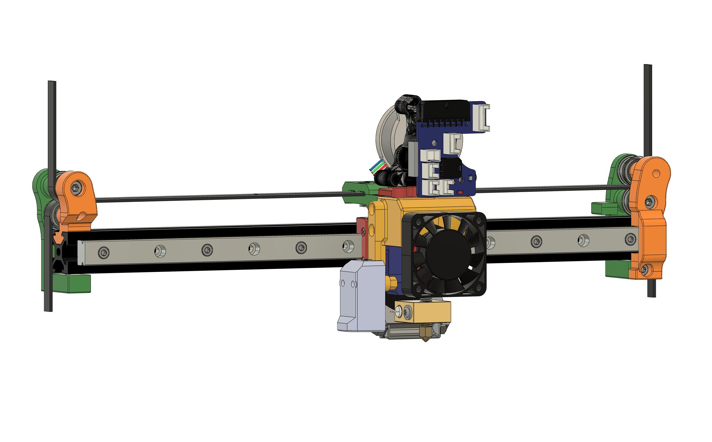
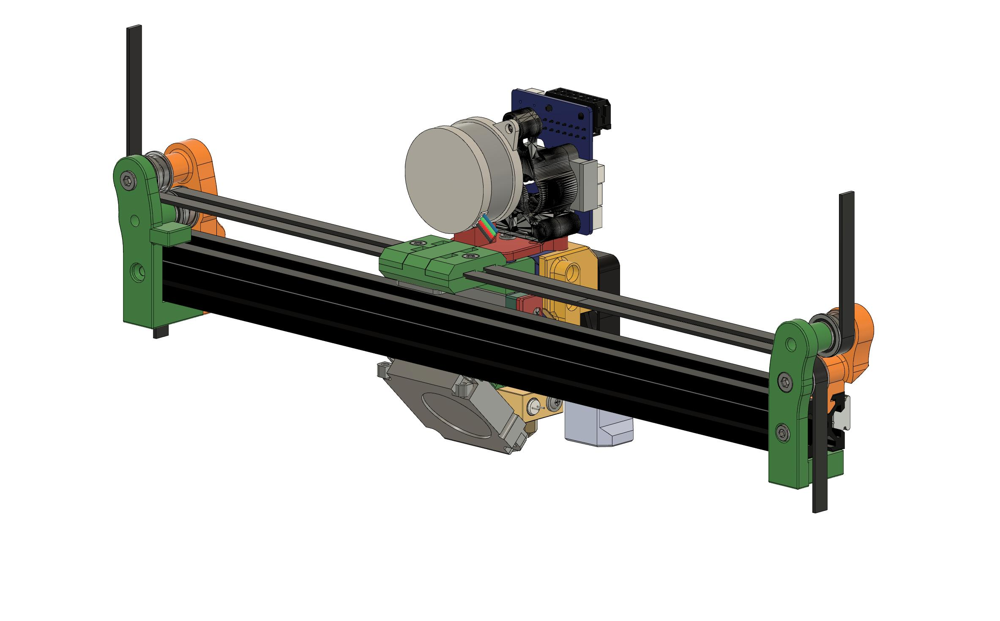
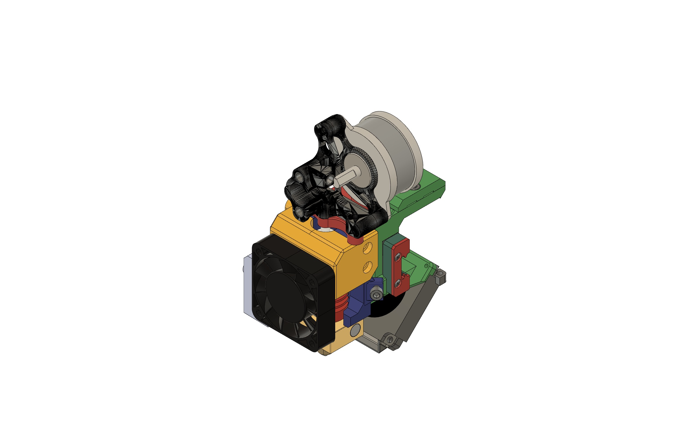
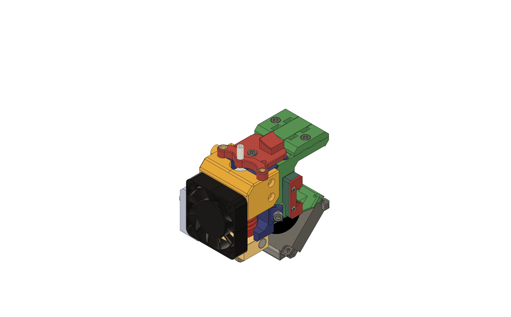
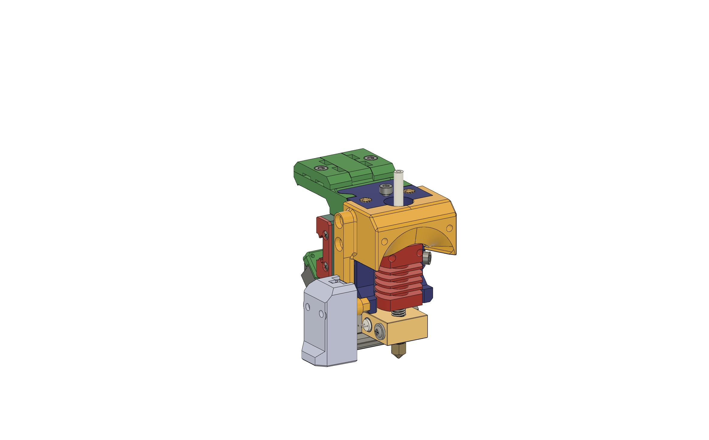
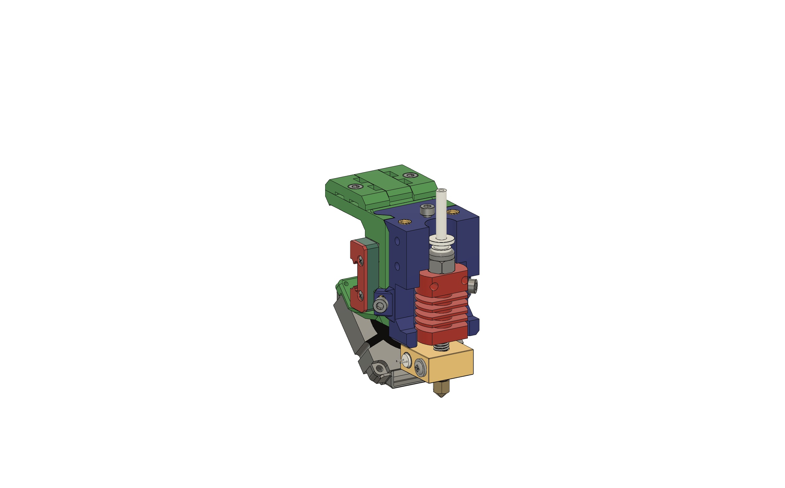
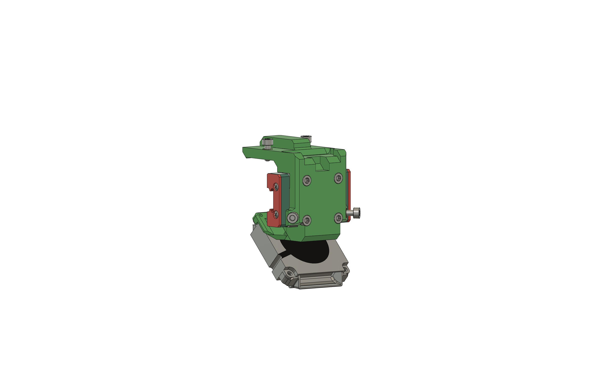

# SychWire

This is a custom modification by the author. From a Voron SwitchWire 3D printer.
Original Link project: https://github.com/VoronDesign/Voron-Switchwire

It is based on CORE XZ.

Therefore this repository will only have new elements modified by the author.
The changes have been made to facilitate the change of the head and lighter X-axis parts while maintaining the functionality and allowing the head to move up to the edges of the bed.
to the edges of the bed. In base I have used Ender 3 Pro which has a 235x235mm bed.

In the mod I use:

* Sherpa with a modified part to place the PCB board in front of the head (Mellow Voron 2,4 R2 Trident Stealthburner)
* Sherpa used with motor LDO Nema 14 8T
* Use of reiles in the three axes X, Y and Z.
* The X-axis has new lateral supports, which are more flexible and more leggy.
    * Left side:
        * It is mounted with two M3x10 screws and fastened with two M3 nuts that are inserted into the rail.
        * It is bolted with a dowel screw, bearings and turecas in between.
        * The front piece is inserted into the rail.
    * Right side:
        * It is mounted with two M3x10 screws and fastened with two M3 nuts that are inserted into the rail.
        * It is bolted with a dowel screw, bearings and turecas in between.
        * The front piece is screwed to the rear piece with a brass isert.
* The belt is used GT2 of 6mm width and 2mm pitch. It is passed over the top of the X-axis and fastened with a belt tensioner on the head piece.
* Head set:
    * Standard CR10 hotend is used.
    * It has a 2020 front fan (comes in Ender).
    * It has a 4020 layer fan (comes in Ender).
    * In this version I use Eddy Coil that connects with USB to RPi Zero W.

* Software
    * Klipper (se adjuntan configuraciones)

---

# Head set

It consists of a fixed part that is part of the base and is screwed to the rail reel with four M3x10 screws.
In which the stopend is screwed at the rear, it has to be placed before screwing the base. The same is true for the fan layer, which is screwed on with two screws that come as standard.

Once screwed, the straps can be mounted and fastened with its corresponding screw on each side.

On top of the base, the rest of the elements are fitted: top cover with Eddy Coil, fan, Hotend, Sherpa and PCB board.

---

## Star History

